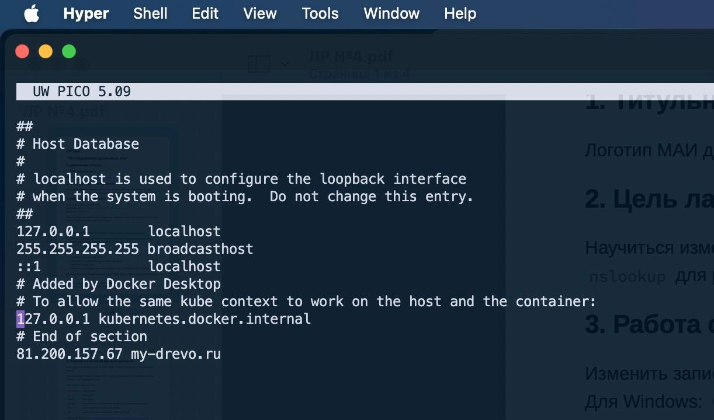
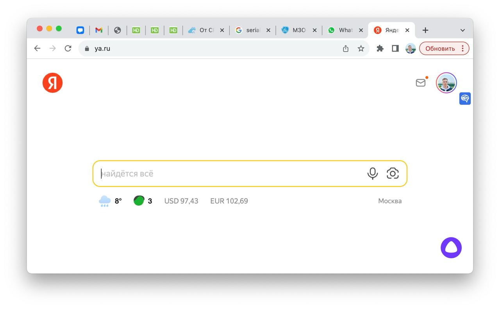
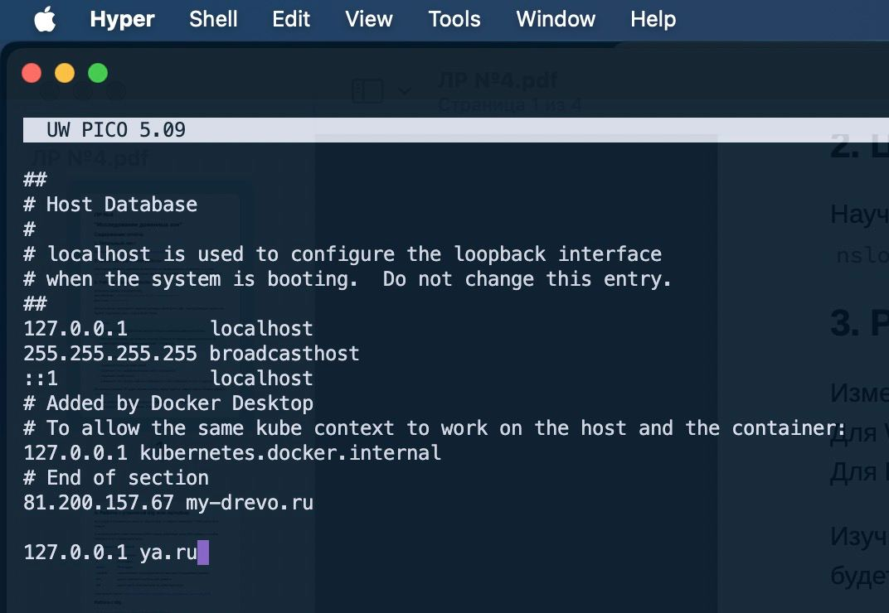
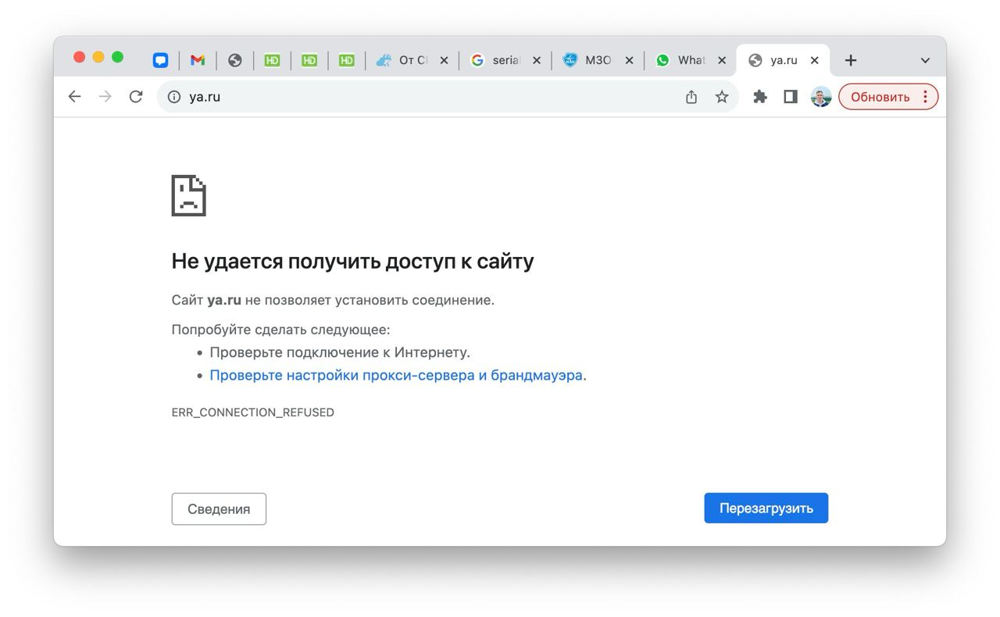

# Отчет по лабораторной работе №4

В рамках данной лабораторной работы было проведено исследование доменных зон и изменение записей в файле hosts на
операционной системе MacOS.

---

## Содержание

1. [Введение](#Введение)
2. [Список исполнителей](#Список-исполнителей)
3. [Работа с файлом hosts](#Работа-с-файлом-hosts)
4. [Работа с утилитой dig](#Работа-с-утилитой-dig)
5. [Вывод](#Вывод)

---

## Введение

Целью данной лабораторной работы является ознакомление с процессом изменения записей в файле hosts и работой с утилитой
dig для исследования доменных зон. Эти навыки могут быть полезными при администрировании систем и настройке сетей.

---

## Список исполнителей

**Московский Авиационный Институт (МАИ)**  
*Институт 3 «Системы управления, информатика и электроэнергетика»*  
Кафедра 307 «Цифровые технологии и информационные системы»

**Работу выполнил студент группы М3О-214Б-22 — Бедретдинов Андрей Маратович**

---

## Работа с файлом hosts

### Изменение записей в файле hosts

Для начала изменим записи в файле hosts. На MacOS файл hosts находится в `/etc/hosts`. Выберем сайт, чью доменную запись
мы будем перезаписывать через файл hosts.

1. Отредактируем файл hosts. Для этого откроем терминал и используем команду:
   ```bash
   sudo nano /etc/hosts
   ```

2. Внесем изменения в файл hosts. Например, добавим запись для сайта "ya.ru", указав IP-адрес 127.0.0.1:
   ```
   127.0.0.1   ya.ru
   ```

3. Сохраним изменения, нажав `Ctrl + O`, затем `Enter`, закроем файл, нажав `Ctrl + X`.

4. Для убедительности проверим, что выбранный сайт больше не открывается. Откроем веб-браузер и введем "ya.ru" в
   адресной строке.

### Скриншоты

1. Скриншот файла hosts до изменений.
   

2. Скриншот, демонстрирующий, что выбранный сайт (ya.ru) открывается.
   

3. Скриншот файла hosts после изменений.
   

4. Скриншот, демонстрирующий, что теперь сайт не открывается.
   

---

## Работа с утилитой dig. Исследование доменных зон

Теперь проведем исследование доменных зон с использованием утилиты dig. Для этого выберем 4 доменные зоны и найдем
минимум 7 DNS записей в каждой.

Для каждой доменной зоны найдены следующие DNS записи:

### Доменная зона ya.ru

| Тип записи | Значение |
|------------|----------|
| A          | 5.255.255.242 |
| A          | 77.88.55.242 |
| AAAA       | 2a02:6b8::2:242 |
| SOA        | ns1.yandex.ru, sysadmin.yandex.ru. |
| MX         | mx.yandex.ru. |
| NS         | ns2.yandex.ru. |
| NS         | ns1.yandex.ru. |

### Доменная зона mail.ru

| Тип записи | Значение |
|------------|----------|
| A          | 94.100.180.200 |
| A          | 94.100.180.201 |
| A          | 217.69.139.200 |
| A          | 217.69.139.202 |
| AAAA       | 2a00:1148:db00:0:b0b0::1 |
| SOA        | ns1.mail.ru, hostmaster.mail.ru. |
| MX         | mxs.mail.ru. |
| NS         | ns1.mail.ru. |
| NS         | ns2.mail.ru. |

### Доменная зона ozon.ru

| Тип записи | Значение |
|------------|----------|
| A          | 162.159.140.11 |
| A          | 172.66.0.11 |
| SOA        | nsz502s1.ozon.ru, dnsmaster.ozon.ru. |
| MX         | cesp10-in.mss.bi.zone. |
| MX         | cesp20-in.mss.bi.zone. |
| MX         | cesp00-in.mss.bi.zone. |
| NS         | nsz503s1.ozon.ru. |
| NS         | ns8-l2.nic.ru. |
| NS         | nsz502s1.ozon.ru. |
| NS         | nsz501s1.ozon.ru. |
| NS         | ns4-l2.nic.ru. |

### Доменная зона google.com

| Тип записи | Значение |
|------------|----------|
| A          | 142.250.81.238 |
| AAAA       | 2607:f8b0:4006:816::200e |
| SOA        | ns1.google.com, dns-admin.google.com. |
| MX         | smtp.google.com. |
| NS         | ns1.google.com. |
| NS         | ns2.google.com. |
| NS         | ns3.google.com. |
| NS         | ns4.google.com. |

## Вывод

В ходе выполнения данной лабораторной работы изучены процесс изменения записей в файле hosts и работа с
утилитой dig для исследования доменных зон. Также выявлено, как изменение записей в файле hosts влияет на доступ к
сайтам. Эти навыки могут быть полезны при администрировании систем и настройке сетей.